# Analysis of various Image Segmentation using C++

This project implements a comprehensive image segmentation application using C++ with GTK3 for the graphical user interface and OpenCV for image processing capabilities. The application provides multiple segmentation algorithms, offering users flexibility in how they want to analyze and segment their images.

## Backtracking Segmentation

Backtracking is used to solve problems incrementally, building paths to the solutions, and abandoning a path as soon as it is determined that it cannot lead to a valid solution. In the context of image segmentation, backtracking is applied to explore and segment regions of an image based on certain criteria, such as pixel intensity. The algorithm starts from a seed point and explores neighboring pixels, adding them to the segmented region if they meet the criteria such as similar intensity of pixels.

The **Basic Backtracking** algorithm uses a 4-directional connectivity approach to segment regions based on pixel intensity. A new, extended backtracking implemented in this project uses an 8-directional backtracking, which includes diagonal neighbors, allowing for more comprehensive region coverage and better handling of complex shapes. 

Furthermore, the **Backtracking Improved** algorithm incorporates a bilateral filter to reduce noise while preserving edges, which enhances the segmentation quality by ensuring that only relevant regions are included. 

The **Backtracking Edge Enhanced** method goes a step further by applying advanced pre-processing techniques such as bilateral filtering and CLAHE (Contrast Limited Adaptive Histogram Equalization) to enhance contrast and edge detection.Then it employs a multi-scale edge detection and adaptive thresholding to refine the initial segmentation using Sobel. This is followed by a smart region growing algorithm with backtracking that considers intensity and gradient continuity. These enhancements make the backtracking segmentation more robust, allowing it to handle noise, varying lighting conditions, and complex textures more effectively, resulting in more accurate and visually appealing segmentation results with a confidence scoring.

### Basic Backtracking

 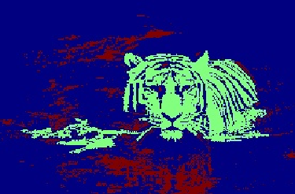

### Backtracking Enhanced

 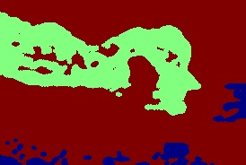

### Backtracking Edge Enhanced

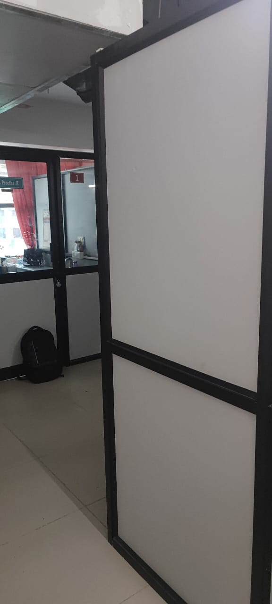 &nbsp; &nbsp;  

## Active Contours

Active Contours, or “Snakes,” is a dynamic, energy-minimization based image segmentation technique. It starts with an initial contour and iteratively deforms it to tightly wrap around the object boundaries by minimizing an energy functional. This method is especially powerful for detecting complex, smooth, and continuous object edges in an image. It balances between keeping the contour smooth (internal energy) and aligning it to object features like edges (external energy).

The contour evolution is driven by three forces:
- Elasticity (α): Keeps points on the contour close to each other.
- Curvature (β): Smoothens the contour to avoid sharp corners.
- Image Forces (γ): Pull the contour toward image features (e.g., edges).

In our implementation, we use Canny edge detection to guide the snake. We also apply contour selection, iterative contour updates, and visual feedback to finalize the segmentation. The method is capable of handling moderately complex shapes and is resistant to noise when appropriately tuned.

 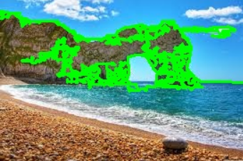

## K-Means Clustering

K-Means Clustering is an unsupervised machine learning algorithm that segments an image based on pixel intensity similarity by grouping pixels into k clusters. It treats each pixel as a data point in a feature space and assigns it to one of k clusters such that intra-cluster similarity is high and inter-cluster similarity is low. 

In the context of image segmentation, K-Means is especially effective in separating regions with distinct intensity or color characteristics. Unlike backtracking or active contours which rely on connectivity or edges, K-Means uses a global optimization strategy, making it robust for texture-less regions and segmentation based on intensity distributions

 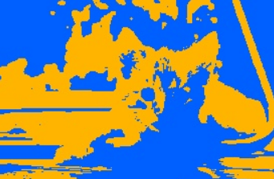 

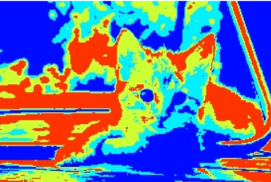 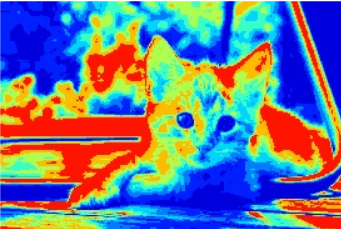

K-Means Clustering for 2,4 and 8 Clusters Chosen

## Otsu Thresholding

Otsu’s Method is a global thresholding technique that automatically determines the optimal threshold value to separate foreground and background in a grayscale image. It assumes the image contains two classes of pixels and calculates the threshold that minimizes the intra-class variance or equivalently maximizes inter-class variance. This makes it particularly effective for segmenting high-contrast regions and binary partitioning in images. In image segmentation, Otsu’s method is commonly used for quick and efficient binarization of grayscale images without manually tuning the threshold value.

 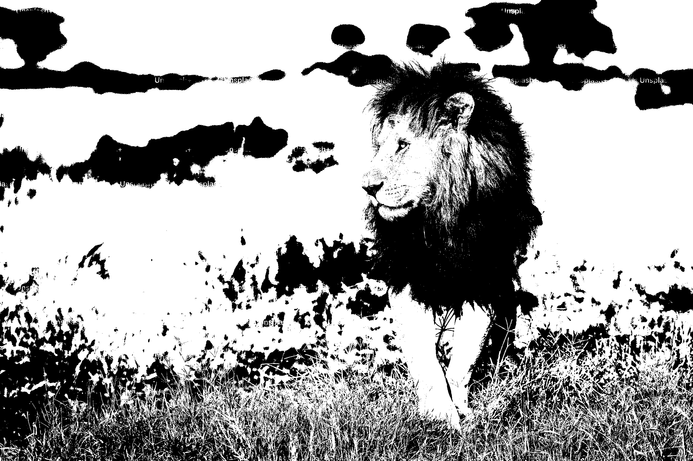 

Chosen Threshold by Otsu Algorithm

## Watershed Segmentation

The Watershed algorithm is a powerful image segmentation technique that treats the grayscale image as a topographic surface, where pixel intensities represent elevation. The algorithm simulates a flooding process, where water is poured onto the surface from predefined markers, filling basins and creating watershed lines that separate different catchment areas.

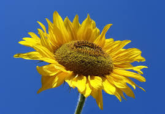 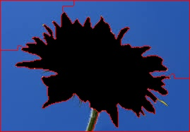 

## Graph Cut Segmentation

The Graph Cut algorithm is a segmentation technique that models the image as a graph, where pixels are nodes and edges represent the relationship between them, such as intensity differences. The algorithm aims to partition the graph into two disjoint sets of foreground and background and finds the minimum cut, which is the set of edges with the smallest total weight that, when removed, separates the graph into the desired segments. This is done using a GrabCut algorithm over a number of set iterations (5 iterations were chosen for this project)

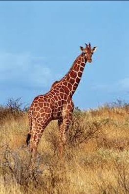 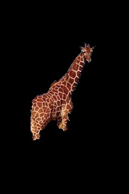 

## Region Growing

The Region Growing algorithm is a simple yet effective image segmentation technique that starts from a seed point and expands the region by adding neighboring pixels that have similar properties, such as intensity.

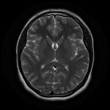 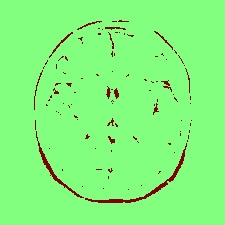 

This image segmentation application provides a robust and user-friendly interface for applying various segmentation algorithms to images. Its modular design allows for easy extension and modification, while the comprehensive GUI makes it accessible to users without programming experience. The implementation of multiple algorithms provides flexibility in handling different types of images and segmentation requirements.The combination of GTK3 for the interface and OpenCV for image processing creates a powerful tool that can be used in various applications, from medical image analysis to computer vision research. The real-time feedback and parameter adjustment capabilities make it particularly useful for experimental and educational purposes
