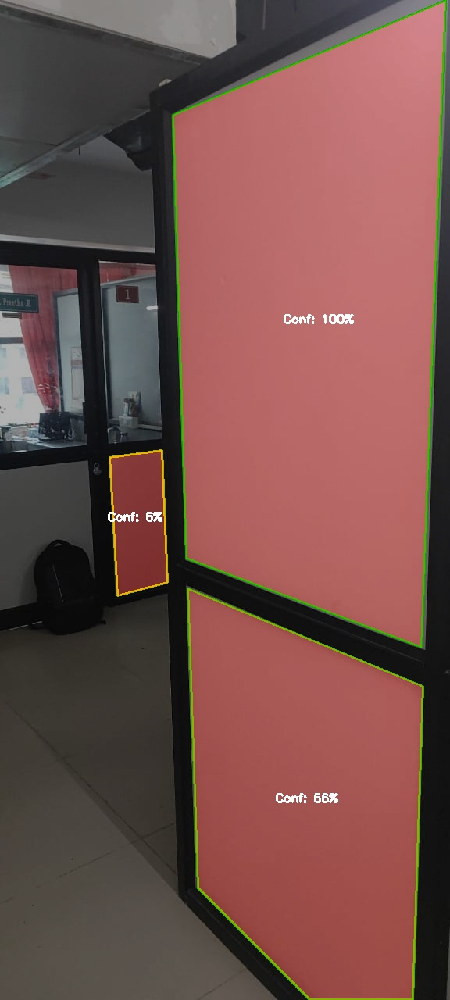

# Analysis of various Image Segmentation using C++

This project implements a comprehensive image segmentation application using C++ with GTK3 for the graphical user interface and OpenCV for image processing capabilities. The application provides multiple segmentation algorithms, offering users flexibility in how they want to analyze and segment their images.

## Backtracking Segmentation

Backtracking is used to solve problems incrementally, building paths to the solutions, and abandoning a path as soon as it is determined that it cannot lead to a valid solution. In the context of image segmentation, backtracking is applied to explore and segment regions of an image based on certain criteria, such as pixel intensity. The algorithm starts from a seed point and explores neighboring pixels, adding them to the segmented region if they meet the criteria such as similar intensity of pixels.

The **Basic Backtracking** algorithm uses a 4-directional connectivity approach to segment regions based on pixel intensity. A new, extended backtracking implemented in this project uses an 8-directional backtracking, which includes diagonal neighbors, allowing for more comprehensive region coverage and better handling of complex shapes. 

Furthermore, the **Backtracking Improved** algorithm incorporates a bilateral filter to reduce noise while preserving edges, which enhances the segmentation quality by ensuring that only relevant regions are included. 

The **Backtracking Edge Enhanced** method goes a step further by applying advanced pre-processing techniques such as bilateral filtering and CLAHE (Contrast Limited Adaptive Histogram Equalization) to enhance contrast and edge detection.Then it employs a multi-scale edge detection and adaptive thresholding to refine the initial segmentation using Sobel. This is followed by a smart region growing algorithm with backtracking that considers intensity and gradient continuity. These enhancements make the backtracking segmentation more robust, allowing it to handle noise, varying lighting conditions, and complex textures more effectively, resulting in more accurate and visually appealing segmentation results with a confidence scoring.

### Basic Backtracking

 

### Backtracking Enhanced

 

### Backtracking Edge Enhanced

 &nbsp; &nbsp;  

## Backtracking Segmentation
